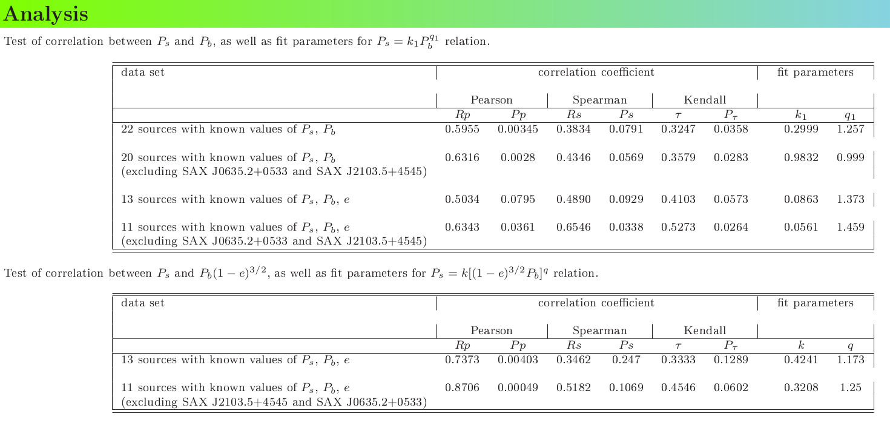

# Correlation Study: Spin and Orbital Periods in HMXBs

This project investigates correlations between the **spin period (Pₛ)**
of neutron stars and the **orbital period (P_b)** of their binary
systems in **High Mass X-ray Binaries (HMXBs)** within the Milky Way
Galaxy.

The analysis includes statistical correlation tests using:
- **Pearson coefficient**
- **Spearman coefficient**
- **Kendall's tau coefficient**

Two correlation models are tested:
1. Pₛ = k₁ P_b\^(q₁)\
2. Pₛ = k \[(1 - e)\^(3/2) P_b\]\^q

### Folder Contents

-   **images/**
    Contains figures illustrating correlation coefficients and best-fit
    parameters.
    

-   **poster.pdf**
    A summary poster of the analysis, including detailed results and
    tables.
